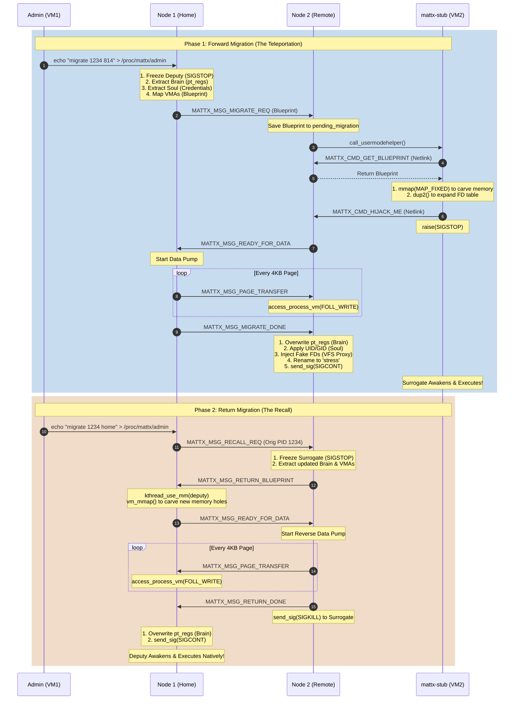
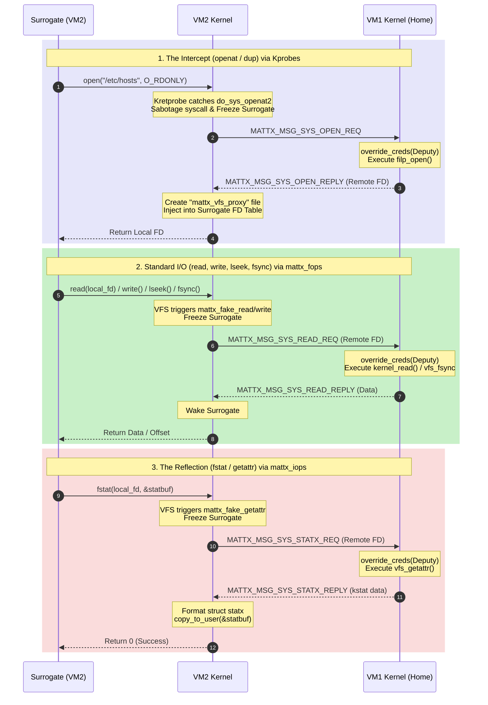

# 📖 The MattX Grimoire: Internal Function Documentation

***

***

## 🕳️ The VFS Wormhole (Syscall Routing Architecture)

To maintain the perfect illusion of a Single System Image, a migrated process (Surrogate) must retain access to the exact filesystem, file descriptors, and standard I/O streams of its Home Node. This is achieved via the "Wormhole"—a combination of Kprobes and custom Virtual File System (VFS) operations.

### Wormhole Methods Detailed Description
*   **`open` / `openat`**: Caught using `kretprobe` on `do_sys_openat2`. The syscall is sabotaged locally on VM2 to prevent empty files from being created. The request is sent to VM1, which opens the file using the Deputy's credentials. VM2 then injects a ghost file (`anon_inode_getfile`) into the Surrogate's file descriptor table, attached to our custom `mattx_fops`.
*   **`read` / `write`**: Hooked natively via `mattx_fops.read` and `.write`. Data is intercepted at the VFS layer, chunked if necessary, and pumped over TCP to VM1 where `kernel_read` or `kernel_write` is executed on the true file descriptor.
*   **`lseek` (The Navigator)**: Hooked via `mattx_fops.llseek`. We cannot seek locally because VM2 does not know the true size of the file. The seek is evaluated on VM1, and the resulting absolute offset is returned to VM2.
*   **`stat` / `fstat` / `statx` (The Reflection)**: Hooked via `mattx_iops.getattr` on our ghost inode. When the Surrogate queries file metadata, VM1 performs `vfs_getattr` and sends the real Ext4/XFS filesystem attributes (size, permissions, timestamps). VM2 copies this directly into the Surrogate's memory buffer.
*   **`dup` / `dup2` (The Cloner)**: Caught using `kretprobe` on `__x64_sys_dup` and `sys_dup2`. VM1 explicitly duplicates its kernel `struct file *` reference so that if the Surrogate closes one of the cloned file descriptors, the actual Wormhole connection to the other descriptor is not severed.
*   **`fsync` / `fdatasync` (The Synchronizer)**: Hooked via `mattx_fops.fsync`. Forces VM1 to execute `vfs_fsync_range` against the physical disk to guarantee data permanence, then relays the success code back to VM2.
*   **`close`**: Hooked via `mattx_fops.release`. VM2 sends a `CLOSE_REQ` so VM1 can drop its reference count on the true file descriptor, properly freeing resources across the cluster.

***

## 📂 File: mattx_main.c
*This file acts as the central nervous system of the module, handling initialization, the Netlink bridge to user-space, and the global registries.*

### Function: is_guest_process / add_guest_process / remove_guest_process
*   **Declared in:** mattx.h
*   **Subsystem:** Guest Registry (Lifecycle Management)
*   **Usage:** To track which processes on the local node are actually "Surrogates" (migrated guests) rather than native processes. We need this to prevent "Cluster Ping-Pong" and to know who to kill when an Assassination Order arrives.
*   **Detailed Description:** These functions manage a spinlock-protected array. When a Surrogate is successfully awakened, it is added here. The `is_guest_process` function iterates through the array to check if a given PID belongs to a guest.
*   **Background:** In a true SSI, a node must distinguish between its own citizens and visiting tourists. If we didn't track this, the Load Balancer would see a heavy Surrogate and immediately migrate it *again*, causing an endless loop of migrations.

### Function: add_export_process / remove_export_process / get_export_target
*   **Declared in:** mattx.h
*   **Subsystem:** Export Registry (Lifecycle Management)
*   **Usage:** To track which native processes have been teleported away, leaving behind a frozen "Deputy". 
*   **Detailed Description:** Manages a spinlock-protected array of exported PIDs and their target Node IDs. `get_export_target` allows the Recall Trigger to look up exactly where a process was sent so it can ask for it back.
*   **Background:** openMosix relied heavily on the Deputy to maintain the illusion of home. By tracking exports, we ensure that if the user kills the Deputy, we know exactly which remote node to send the Assassination Order to.

### Function: mattx_nl_cmd_node_join / mattx_nl_cmd_node_leave
*   **Declared in:** Static to mattx_main.c
*   **Subsystem:** Generic Netlink Interface
*   **Usage:** The bridge between the `mattx-discd` user-space matchmaker and the kernel's TCP socket layer.
*   **Detailed Description:** Extracts the Node ID and IP address from the incoming Netlink payload. It then triggers the kernel-space TCP connection routine to establish the high-speed data pipe.
*   **Background:** Doing network discovery inside the kernel is frowned upon in modern Linux. By delegating UDP multicast to user-space and using Netlink to pass the results down, we keep the kernel module fast and secure.

### Function: mattx_nl_cmd_get_blueprint
*   **Declared in:** Static to mattx_main.c
*   **Subsystem:** Generic Netlink Interface
*   **Usage:** Allows the `mattx-stub` (the empty Vessel) to request the DNA of the process it is about to become.
*   **Detailed Description:** Allocates a new Netlink reply buffer, packs the globally stored `pending_migration` structure into it, and sends it directly back to the PID of the stub that requested it.
*   **Background:** We cannot easily carve memory from inside the kernel. By handing the blueprint to the user-space stub, we allow the stub to use the standard, safe `mmap` system call to prepare its own body for the transplant.

### Function: mattx_nl_cmd_hijack_me
*   **Declared in:** Static to mattx_main.c
*   **Subsystem:** Generic Netlink Interface
*   **Usage:** The signal from the Vessel that it has carved its memory and is ready to be overwritten.
*   **Detailed Description:** Safely looks up the stub's `task_struct` using RCU locks, saves it to a global pointer, and sends the `READY_FOR_DATA` network packet to the Home Node to open the data pump.
*   **Background:** This is the synchronization mechanism that prevents the "Race Condition" where the Home Node sends memory pages before the Remote Node has finished carving the memory holes.

---

## 📂 File: mattx_hooks.c
*The Kprobe interception subsystem. It catches system calls before the local VFS can process them.*

### Function: entry_handler_openat / entry_handler_dup
*   **Declared in:** Static to mattx_hooks.c
*   **Subsystem:** System Call Hijacking
*   **Usage:** To intercept file opening and file descriptor cloning on the Surrogate.
*   **Detailed Description:** Uses Linux Kretprobes on `do_sys_openat2`, `__x64_sys_dup`, and `__x64_sys_dup2`. When triggered by a Guest Process, it extracts the arguments, sabotages the local syscall by forcing an invalid argument into the registers (preventing local file creation), freezes the Surrogate with `SIGSTOP`, and schedules an RPC worker to send the request to the Home Node.

## 📂 File: mattx_fileio.c
*The VFS Proxy subsystem. It maintains the "Ghost Files" and handles the distributed File I/O RPCs.*

### Function: mattx_fake_read / mattx_fake_write / mattx_fake_llseek / mattx_fake_fsync
*   **Declared in:** Static to mattx_fileio.c
*   **Subsystem:** VFS Proxy (The Wormhole)
*   **Usage:** Custom `file_operations` attached to anonymous inodes on VM2.
*   **Detailed Description:** Intercepts standard read/write/seek/sync operations. Routes them over TCP, puts the Surrogate to sleep on a Wait Queue, and seamlessly returns the fetched data or offset to user-space when VM1 replies.

### Function: mattx_fake_getattr
*   **Declared in:** Static to mattx_fileio.c
*   **Subsystem:** The Reflection (Metadata Spoofing)
*   **Usage:** Custom `inode_operations` attached to ghost files. Intercepts `fstat` and `statx` calls.
*   **Detailed Description:** Asks VM1 for the real physical file metadata, and dynamically unpacks the results into the Surrogate's memory buffer, bypassing the local VM2 kernel's dummy attributes.

## 📂 File: mattx_comm.c
*The networking subsystem. This is where data moves across the cluster.*

### Function: mattx_handle_message
*   **Declared in:** Static to mattx_comm.c
*   **Subsystem:** Cluster Protocol State Machine
*   **Usage:** The grand central dispatcher for all incoming TCP cluster traffic.
*   **Detailed Description:** A massive switch statement that reacts to the MattX protocol. 
    *   It handles Load Updates.
    *   It catches Blueprints and spawns the Surrogate.
    *   It catches Page Transfers and uses `access_process_vm` to inject the memory into the Vessel.
    *   It catches the `MIGRATE_DONE` signal to perform the final "Awakening" (overwriting the Brain/Registers, injecting the Soul/Credentials, and sending `SIGCONT`).
    *   It handles the Funeral (killing Deputies) and Assassinations (killing Surrogates).
*   **Background:** This function is the heart of the SSI. It proves that we can manipulate the deepest structures of a Linux process remotely.

### Function: mattx_receiver_loop
*   **Declared in:** mattx.h
*   **Subsystem:** TCP Socket Layer
*   **Usage:** A dedicated kernel thread for each connected node that constantly listens for incoming data.
*   **Detailed Description:** Reads the MattX Magic Number to ensure stream synchronization. It safely allocates memory using `kvmalloc` (to prevent large allocation warnings), reads the payload using `MSG_WAITALL`, and passes it to the handler.
*   **Background:** Kernel sockets are tricky. If we don't use a dedicated thread, we would block the entire kernel. 

---

## 📂 File: mattx_sched.c
*The Brain of the cluster. It decides who moves, when they move, and cleans up the dead.*

### Function: mattx_find_candidate_task
*   **Declared in:** Static to mattx_sched.c
*   **Subsystem:** Process Hunter
*   **Usage:** To find the heaviest, most eligible user-space process to migrate.
*   **Detailed Description:** Walks the entire Linux process list under an RCU read lock. It filters out kernel threads, the `init` process, MattX daemons, and existing Guests. It then compares the `sum_exec_runtime` of all valid tasks to find the ultimate CPU hog.
*   **Background:** You cannot migrate everything. Trying to migrate a hardware driver or `systemd` will instantly panic the kernel. This function ensures we only hunt safe prey.

### Function: mattx_evaluate_and_balance
*   **Declared in:** Static to mattx_sched.c
*   **Subsystem:** Decision Engine
*   **Usage:** To determine if the local node is overloaded compared to its peers.
*   **Detailed Description:** Compares the local fixed-point CPU load against the cluster map. If the local load is high and a remote node is idle, it calls the Process Hunter and triggers a migration.
*   **Background:** This is the core of the openMosix philosophy: dynamic, autonomous load balancing without user intervention.

### Function: mattx_balancer_loop
*   **Declared in:** mattx.h
*   **Subsystem:** Heartbeat & Funeral Director
*   **Usage:** A periodic kernel thread that broadcasts load metrics and cleans up dead processes.
*   **Detailed Description:** Every 2 seconds, it sends the local CPU/Memory stats to all peers. It then scans the Guest Registry and Export Registry. If it finds a Zombie or Dead process, it sends the appropriate Death Certificate or Assassination Order across the network.
*   **Background:** Processes die. If we don't clean up the tethers between the Deputy and the Surrogate, the cluster will slowly bleed memory and PID space until it crashes.

---

## 📂 File: mattx_migr.c
*The Teleporter. It handles the extraction of state and the pumping of memory.*

### Function: mattx_capture_and_send_state
*   **Declared in:** mattx.h
*   **Subsystem:** Forward Migration (Extraction)
*   **Usage:** To freeze a native process and extract its DNA for a forward migration.
*   **Detailed Description:** Sends `SIGSTOP` to the target. Extracts the Brain (`pt_regs`), the Soul (`fsbase`/`gsbase`), the Identity (UID/GID/Name), the Command Line pointers, and the open File Descriptors. It uses the modern `VMA_ITERATOR` to map the memory layout. It sends this Blueprint to the target node.
*   **Background:** This function bridges the gap between Linux 2.4 and 6.x, utilizing modern Maple Tree iterators to safely map memory without crashing.

### Function: mattx_capture_and_return_state
*   **Declared in:** mattx.h
*   **Subsystem:** Return Migration (Recall Extraction)
*   **Usage:** To freeze a Surrogate and extract its *updated* DNA to send it back home.
*   **Detailed Description:** Almost identical to the forward extraction, but it explicitly tags the Blueprint with the original Deputy's PID so the Home Node knows which frozen body to inject the memories back into.

### Function: mattx_send_vma_data
*   **Declared in:** mattx.h
*   **Subsystem:** The Data Pump
*   **Usage:** To stream the physical memory of a frozen process across the network.
*   **Detailed Description:** Iterates through every VMA in the blueprint. It chunks the memory into 4KB pages, uses `access_process_vm` with `FOLL_FORCE` to safely read the bytes (even if they are protected or swapped), and sends them over TCP. Once finished, it triggers the `MIGRATE_DONE` or `RETURN_DONE` signal.
*   **Background:** We cannot send a 1GB heap in one packet. Chunking it into pages ensures network stability and prevents kernel memory exhaustion.

### Function: mattx_trigger_recall
*   **Declared in:** mattx.h
*   **Subsystem:** The Recall Trigger
*   **Usage:** Initiates the "Pull" migration to bring a process home.
*   **Detailed Description:** Looks up the target node in the Export Registry and sends a `RECALL_REQ` packet.
*   **Background:** Designed by Lead Architect Matt to provide a clean, user-friendly way to retrieve processes without needing to SSH into remote nodes.

---

## 📂 File: mattx_proc.c
*The KIS (Keep It Simple) Administration Interface.*

### Function: nodes_show / admin_write
*   **Declared in:** Static to mattx_proc.c
*   **Subsystem:** ProcFS Interface
*   **Usage:** To provide a scriptable, text-based UI for the cluster.
*   **Detailed Description:** `nodes_show` formats the cluster map into a beautiful text table (including the Local node). `admin_write` parses strings like `balancer 0` or `migrate 1234 home` and translates them into internal kernel function calls.
*   **Background:** A direct homage to the `/proc/hpc` interface of openMosix. It proves that powerful cluster management doesn't require complex binary tools.

---

## 📂 User-Space Tools

### Tool: mattx-discd (The Matchmaker)
*   **Usage:** Runs in the background, broadcasting UDP beacons to `239.0.0.1`. When it hears a new beacon, it uses `libnl-3` to send a Generic Netlink message to the kernel, triggering a TCP connection. It completely eliminates the need for static cluster configuration files.

### Tool: mattx-stub (The Vessel)
*   **Usage:** Spawned by the kernel on a remote node. It asks the kernel for the incoming Blueprint. It uses `mmap(MAP_FIXED)` to carve out the exact memory holes required by the incoming Frankenstein. It expands its File Descriptor table using `dup2()`. It then sends `HIJACK_ME` and calls `raise(SIGSTOP)`, going into a coma so the kernel can overwrite its Brain and Soul.

