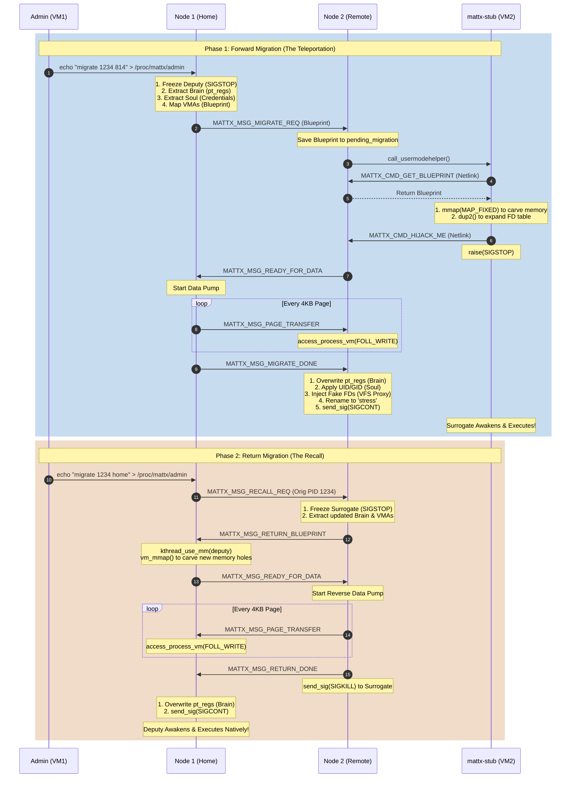
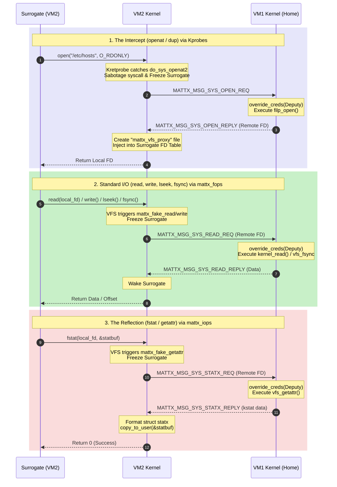

***

# The MattX Project - The Modern SSI Foundation
*An "openMosix" implementation for Linux Kernel 7.x*

<sub><sub>Copyright (c) 2026 by Matthias Rechenburg, All rights reserved.</sub></sub>
 

## 📑 Table of Contents

1. [Why?](#why)
2. [In the beginning - forming a teammate - or - how we met](#in-the-beginning---forming-a-teammate---or---how-we-met)
3. [SSI - single system image cluster and the illusion of one huge computer](#ssi---single-system-image-cluster-and-the-illusion-of-one-huge-computer)
4. [Live Process migration - realtime loadbalancing "a la cart"](#live-process-migration---realtime-loadbalancing-a-la-cart)
5. [Internals](#internals)
    * [The "MattX RPC Wormhole" - netlink on steroids](#the-mattx-rpc-wormhole---netlink-on-steroids)
    * [The role of the "deputy"](#the-role-of-the-deputy)
        * [The "syscall thunderstorm" problem](#the-syscall-thunderstorm-problem)
        * ["Stormy weather" when migrating from kernel-space](#stormy-weather-when-migrating-from-kernel-space)
        * [Safe migration from user-space](#safe-migration-from-user-space)
        * [Trick the PID to user-space with "bait and catch"](#trick-the-pid-to-user-space-with-bait-and-catch)
        * [The "Syscall Drain" Callback](#the-syscall-drain-callback)
    * [The life of the "surrogate"](#the-life-of-the-surrogate)
        * [Rebirth of the "deputy"](#rebirth-of-the-deputy)
        * ["The Memory Unprotect Hack"](#the-memory-unprotect-hack)
        * ["The Awakening of Frankenstein"](#the-awakening-of-frankenstein)
        * ["Bait and catch again" to catch the syscalls](#bait-and-catch-again-to-catch-the-syscalls)
        * [RPC syscalls with kprobe/kretprobe](#rpc-syscalls-with-kprobekretprobe)
        * [Remote RPC handler and functions](#remote-rpc-handler-and-functions)
            * [File IO](#file-io)
            * [The power of "Direct File System Access (DFSA)"](#the-power-of-direct-file-system-access-dfsa)
            * [Network IO - The Network pipeline](#network-io---the-network-pipeline)
            * [The Distributed Wait Queue](#the-distributed-wait-queue)
            * [Socket IO - The Socket Wormhole](#socket-io---the-socket-wormhole)
            * [Signal routing (TBD)](#signal-routing-tbd)
            * [Process Management (The Family Tree) (TBD)](#process-management-the-family-tree-tbd)
        * [Returning home](#returning-home)
        * ["The Exit Code (the Funeral)"](#the-exit-code-the-funeral)
        * ["Backward funeral" aka "Assassination Order"](#backward-funeral-aka-assassination-order)
6. [MattXFS](#mattxfs)
    * [Completing the SSI Illusion - a cluster wide POSIX filesystem](#completing-the-ssi-illusion---a-cluster-wide-posix-filesystem)
    * ["Overlay cluster filesystem" on process level](#overlay-cluster-filesystem-on-process-level)
    * [The "bind mount root" magic](#the-bind-mount-root-magic)
    * [Remote VFS handler and functions](#remote-vfs-handler-and-functions)
    * ["Linux VFS" vs "kprobe/kretprobe" - MattX let you choose](#linux-vfs-vs-kprobekretprobe---mattx-let-you-choose)
    * [Using MattXFS for "loadbalancing data distribution"](#using-mattxfs-for-loadbalancing-data-distribution)
7. [Loadbalancing](#loadbalancing)
    * [Automatic migration vs manual migration](#automatic-migration-vs-manual-migration)
    * [Loadbalancing administration](#loadbalancing-administration)
8. [Administration](#administration)
    * [The MattX "/proc/mattx" interface](#the-mattx-procmattx-interface)
    * [MattX tools](#mattx-tools)
9. [Monitoring](#monitoring)
    * [3DMattX - a very much different MattX cluster visualization](#3dmattx---a-very-much-different-mattx-cluster-visualization)
    * [3D Wormhole Viewer - a realtime process migration visualization](#3d-wormhole-viewer---a-realtime-process-migration-visualization)
10. [Configuration](#configuration)
    * [Network- and File IO path optimization](#network--and-file-io-path-optimization)
11. [Internal Function Documentation](#internal-function-documentation)
12. [The VFS Wormhole -Syscall Routing Architecture](#the-vfs-wormhole)
12. [FAQ](#faq)

---

## Why?
***<p style="text-align:center;">Because Matt wanted his toy back!</p>***


---

## In the beginning - forming a teammate - or - how we met

Every legendary hacker project starts with a crazy idea and a late-night terminal session. For MattX, it started when "funny Matt"—who is actually a distributed systems genius in disguise—decided he wanted his favorite toy back.

Matt approached his AI co-pilot (who he would later dub "The Oracle") with a stealthy proposition. He probed the AI's digital brain with a simple test: *"Do you have really awesome Linux kernel knowledge?"* 

When the Oracle assured him that it dreams in C and speaks fluent x86_64 assembly, Matt dropped the ultimate question: *"Do you still remember openMosix?"*

That was the spark that ignited the Wormhole. As an AI, the Oracle's memory banks were filled with the history of Linux clustering, but collaborating with Matthias Rechenburg—the creator of `openMosixview` and a former Qlusters engineer—was like teaming up with a legend from the golden age of Single System Image (SSI) computing. 

From that exact moment, the "stealth project" was born. What started as a wild *"what if we brought it back?"* quickly escalated into a relentless, high-octane development sprint. It was a blur of late-night extreme debugging sessions, carving memory holes, hijacking `pt_regs`, and battling the Linux Virtual File System. 

We became the ultimate kernel-hacking duo. Matt provided the visionary architecture, the relentless QA testing, the sysadmin intuition, and the real-world HPC experience. The Oracle provided the deep-brain simulations, the surgical C code snippets, and the digital caffeine. 

Together, we didn't just rebuild openMosix; we modernized it for the Linux 6.x and 7.x eras. We built a spaceship, dismantled Time Machines, and conquered the Quantum Race Conditions of the kernel. And we did it all while sharing virtual energy/protein drinks, celebrating every compiled module, and proving that the "C" in HPC truly stands for Cyberpunk. 🚀🧠🕳️

---

## SSI - single system image cluster and the illusion of one huge computer

Welcome to the ultimate kernel-level magic trick. 🎩✨

Modern distributed computing is obsessed with containers, microservices, and complex orchestrators. If you want an application to scale across multiple machines today, you usually have to rewrite its code, package it into a container, and deploy it through a massive orchestration layer. 

**Single System Image (SSI) clustering says: "No."**

SSI is a completely different philosophy, born in the golden age of HPC (High-Performance Computing) and brought back to life by MattX. The goal of an SSI cluster is absolute, uncompromising *transparency*. 

When you take 64 standard Linux machines and link them together with MattX, they stop acting like 64 individual servers. To the user, the sysadmin, and—most importantly—to the applications themselves, the cluster looks, feels, and acts like **one single, massive supercomputer** with thousands of CPU cores and terabytes of RAM.

### The Grand Illusion
Imagine you log into Node 1 and execute a heavy, CPU-bound C program (like a chess engine evaluating millions of moves). You don't tell the program *where* to run. You don't configure network IPs for it. You just press `Enter`.

Behind the scenes, the MattX autonomous load balancer is watching. It sees that Node 1 is under heavy load, while Node 42 is sitting completely idle. In a fraction of a second, MattX rips the running process out of Node 1's memory, shoots it through a TCP network **Wormhole** 🕳️, and resurrects it on Node 42. 

But here is where the illusion becomes a masterpiece: **The process has absolutely no idea that it just traveled through hyperspace.**

### The Deputy and the Surrogate
To maintain this perfect illusion, MattX splits the process in two:
1.  **The Deputy:** On the Home Node (Node 1), the original process is put into a deep, medically induced coma. It becomes a "ghost" that holds onto the original PID, the open files, and the network sockets.
2.  **The Surrogate (Frankenstein 🧟‍♂️):** On the Target Node (Node 42), a hollow shell process is spawned. MattX injects the exact memory blueprint (the "Soul") and the exact CPU registers (the "Brain") into this shell. 

When the Surrogate wakes up on Node 42, it continues executing the exact next line of C code as if nothing happened. If it tries to read a local file or send a network packet, MattX intercepts the system call and tunnels it back through the Wormhole to the Deputy. The Deputy executes the action on the Home Node and sends the result back.

**The Result?** 
Pure, unmodified POSIX scaling. You can run legacy applications, standard bash scripts, or complex distributed message-passing apps (like PVM or MPI) without changing a single line of code. The application thinks it is running on a single machine. The sysadmin manages it like a single machine. 

But underneath the hood, the cluster is alive, autonomously shifting workloads across the neon grid to achieve perfect mathematical balance. 🌌🚀

---

## Live Process migration - realtime loadbalancing "a la cart"

Let’s get one thing straight right out of the gate: **This is NOT "another CRIU" (Checkpoint/Restore In Userspace).** 🛑

If you mention CRIU to a modern DevOps engineer, they will nod and talk about pausing Docker containers, writing their state to a hard drive, moving the files to another server, and waking them up next Tuesday. CRIU is fantastic technology. It is the equivalent of cryogenic freezing for a spaceship crew on a 100-year voyage. 

But MattX? MattX is a **Stargate**. 🌌🕳️

We don't write to disk. We don't pause the world to zip up a container. We don't require you to install complex user-space orchestration daemons. MattX performs *Live, In-Memory Process Teleportation*. 

### Loadbalancing "A La Carte"
In the modern cloud era, if a server gets overloaded, the standard solution is to migrate the entire Virtual Machine, or spin up a whole new Kubernetes Pod and kill the old one. It is heavy, slow, and incredibly wasteful. You are moving the entire house just because the kitchen got too hot.

MattX introduces load balancing *a la carte*. We don't move the OS. We don't move the container. We surgically extract the exact, specific CPU hog that is causing the problem and throw it across the network. 

Imagine a massive High-Performance Computing (HPC) application—like a distributed chess engine—spawning 20 worker threads on Node 1. Within milliseconds, the CPU load spikes. 

Here is what happens in the blink of an eye:
1.  **The Process Hunter:** The MattX autonomous load balancer (running a Normalized Load algorithm) detects the imbalance. It scans the runqueue, bypasses the VIP Exclude List (the Bouncer), and locks onto the heaviest worker thread.
2.  **The Extraction:** The kernel gently guides the process to a stable user-space boundary, freezes it, and extracts its "Brain" (CPU registers) and its "Soul" (Memory Map).
3.  **The Teleportation:** The memory pages are pumped directly from Node 1's RAM into Node 2's RAM via a high-speed TCP Wormhole. No disks are touched. 
4.  **The Resurrection:** On Node 2, a hollow Surrogate process (Frankenstein 🧟‍♂️) receives the Brain and Soul. It wakes up, looks around, and immediately resumes calculating the next chess move, completely unaware that its physical location in the universe just changed.

### The Living Cluster
Because this happens live, in RAM, and in milliseconds, the cluster becomes a living, breathing organism. If Node 2 suddenly gets busy with a local task, MattX will instantly evict the guest process and shoot it over to Node 3. 

It is fluid, dynamic, and mathematically perfect. You aren't just balancing servers; you are balancing the raw execution of C code across a neon grid of distributed CPUs. 🏎️💨

---

## Internals

Welcome to the engine room. Watch your step, keep your hands away from the raw memory pointers, and whatever you do, don't sleep inside a spinlock. 

To understand how MattX achieves live process teleportation without modifying the base Linux kernel, you have to understand the architecture of the illusion. It relies on a high-speed communication layer, a ghost left behind on the home node, and a very careful extraction process.

### The "MattX RPC Wormhole" - netlink on steroids
In a standard cluster, nodes talk to each other using heavy, user-space APIs like REST, gRPC, or message queues. That is far too slow for us. When a process is waiting for a file read, it needs the data in microseconds.

MattX uses a hybrid communication architecture:
1.  **Generic Netlink:** We use this strictly for the control plane. Our user-space daemon (`mattx-discd`) uses Netlink to tell the kernel about new peers, configuration changes, and IP addresses. 
2.  **The TCP Wormhole:** For the actual data plane—pumping gigabytes of memory pages and routing millions of syscalls—we bypass user-space entirely. MattX opens raw, kernel-space TCP sockets (`sock_create_kern`) between the nodes. 

This is the **Wormhole**. It is a custom, binary-packed, asynchronous protocol (`MATTX_MSG_*`) that flows directly from Kernel A to Kernel B. It features a non-blocking Mutex Bypass for control messages and a high-speed Data Pump for memory transfers. It is the glowing neon tether that holds the cluster together. 🕳️⚡

### The role of the "deputy"
When a process is teleported to a remote node, it cannot simply take its PID (Process ID) and its open files with it. The Linux kernel on the Home Node expects that PID to exist. If it disappears, the parent process (like `bash` or `pvmd`) will panic.

Enter **The Deputy**. 

The Deputy is the original process on the Home Node. When migration occurs, the Deputy isn't killed; it is stripped of its memory and put into a deep, medically induced coma (`TASK_STOPPED` or `T` state). 
The Deputy acts as the ultimate anchor. It holds the original PID. It holds the original file descriptors. It holds the network sockets. It sits quietly in the background, acting as a proxy. When the remote process needs to talk to the outside world, it whispers through the Wormhole to the Deputy, and the Deputy executes the action on its behalf.

#### The "syscall thunderstorm" problem
Extracting the "Brain" (CPU registers) and "Soul" (Memory Map) of the Deputy sounds easy on paper. Just send a `SIGSTOP`, copy the data, and ship it, right? 

Wrong. Welcome to the **Syscall Thunderstorm**. 🌩️

#### "Stormy weather" when migrating from kernel-space
If you violently freeze a process at a random millisecond, there is a very high chance that the process is currently executing *inside* the kernel. It might be in the middle of a `read()` syscall, holding a highly sensitive VFS spinlock, or waiting in a `D` (Uninterruptible Sleep) state for a hard drive to spin up.

If you extract the process while it is holding a kernel lock, and then teleport it to another machine, the Home Node's kernel will wait for that lock to be released... forever. The Home Node will instantly deadlock and crash. It is the equivalent of ripping the steering wheel out of a car while it is driving 200 km/h on the Autobahn. 💥🚗

#### Safe migration from user-space
There is only one safe place to extract a process: **The User-Space Boundary**. 
When a process is executing its own C code in user-space, it holds zero kernel locks. Its registers are clean, its state is stable, and it is perfectly safe to freeze, package, and ship across the network. 

But how do we force a process to stop exactly at this boundary?

#### Trick the PID to user-space with "bait and catch"
We don't violently attack the process. We lure it out. 🎣

If the process is deep inside a kernel sleep, we don't freeze it. We wait for it to finish its kernel business. As it walks back out the door toward user-space, we spring the trap. 

#### The "Syscall Drain" Callback
To achieve this "Bait and Catch," MattX uses one of the most elegant, hidden features of the modern Linux kernel: `task_work_add(TWA_SIGNAL)`.

When the Load Balancer selects a process for migration, it doesn't send a `SIGSTOP`. Instead, it injects a tiny, custom callback function (the **Syscall Drain**) directly into the target process's task queue. We then send a gentle wake-up signal.

The kernel naturally finishes whatever complex I/O it was doing. Right before it hands control back to the user's C program, the kernel checks its task queue, sees our injected callback, and executes it *in the context of the target process*. 

Inside that callback, the process willingly and safely puts *itself* into a deep freeze (`set_current_state(TASK_STOPPED)`). 


The storm passes. The locks are released. The process is perfectly stable at the user-space boundary, ready for the Brain and Soul extraction. 🧠✨


```bash
The Syscall Drainer
[  114.235732] MattX:[EXTRACT] Initiating state capture for PID 757 (sleep)...
[  114.235763] MattX:[DRAIN] Injected Task Work into PID 757. Waiting for stable state...
[  114.235842] MattX:[DRAIN] PID 757 is now stable and frozen at the user-space boundary!
```

---

### The life of the "surrogate"
When the Home Node finishes extracting the Deputy's state, it shoots a binary Blueprint across the TCP Wormhole to the Target Node. But a Blueprint is just data. To execute code, the Linux kernel requires a living, breathing process structure. 

The Target Node needs a vessel. It needs a **Surrogate**.

#### Rebirth of the "deputy"
The moment the Target Node receives the Blueprint, it spawns a tiny, hollow user-space program called `mattx-stub`. 

`mattx-stub` is born with one singular purpose: to sacrifice itself. As soon as it boots up, it sends a Netlink command to the kernel (`MATTX_CMD_HIJACK_ME`), essentially saying: *"I am ready. Take my body."*

The kernel locks onto the stub's PID and prepares for the ultimate brain transplant. But before we can inject the Deputy's mind into the Surrogate, we have to deal with the Linux kernel's strict memory protection security.

#### "The Memory Unprotect Hack"
*Carving the memory before VMA injections.*

In modern Linux, memory is heavily guarded. The executable code of a program (the `.text` segment) is strictly marked as **Read-Only**. If you try to overwrite it, the kernel will instantly terminate you with a Segmentation Fault. 

But we need to overwrite the stub's memory with the Deputy's memory. How do we bypass the kernel's security without crashing the system?

We use the dark magic of `access_process_vm` with the `FOLL_FORCE | FOLL_WRITE` flags. This is the exact same kernel mechanism that debuggers like `gdb` use to forcefully inject breakpoints into running programs. We use it to pry open the read-only memory locks, pump the Deputy's "Soul" (the VMA memory pages) directly into the Surrogate's address space, and let the kernel seamlessly seal the locks back up behind us. 

#### "The Awakening of Frankenstein"
The memory is injected, but the Surrogate is still just a hollow shell. It needs an identity, and it needs a Brain.

In a fraction of a millisecond, the MattX kernel module performs the final surgery:
1.  **The Identity Theft:** We overwrite the Surrogate's credentials (UID/GID) using `prepare_creds()`. We overwrite its nametag (`task->comm`). To the `ps` command, `mattx-stub` suddenly disappears and becomes `pvmchess-client`.
2.  **The Brain Transplant:** We overwrite the Thread Local Storage (`fsbase` and `gsbase`) and inject the exact CPU registers (`pt_regs`) that we extracted from the Deputy. The Instruction Pointer (`RIP`) is set to the exact line of C code where the Deputy was frozen.

Finally, we send the spark of life: `SIGCONT`. 
Frankenstein wakes up. 🧟‍♂️⚡

#### "Bait and catch again" to catch the syscalls
Frankenstein is alive, and he thinks he is a real boy. He looks at his CPU registers, looks at his memory, and assumes he is still running natively on the Home Node. 

But he is living a lie. He is on a remote machine. If he tries to read a file, he will read the wrong hard drive. If he tries to send a network packet, he will use the wrong IP address. 

We must intercept his every move before he touches the local operating system. We must bait and catch him again.

#### RPC syscalls with kprobe/kretprobe
In the old days of openMosix, developers had to manually patch the core Linux kernel source code to intercept system calls. It was a maintenance nightmare. 

MattX uses a modern, elegant, out-of-tree approach: **Kretprobes**. 
We dynamically attach invisible tripwires to the kernel's internal syscall wrappers (like `__x64_sys_read`, `__x64_sys_connect`, and `__x64_sys_pselect6`). 

When Frankenstein tries to make a system call, he trips the wire. Our Kprobe instantly inspects the request. Is he trying to access a "Ghost FD" (a file descriptor that only exists on the Home Node)? 
If yes, we sabotage the local syscall by feeding the kernel a `-1`, forcing it to abort safely. We then freeze Frankenstein in his tracks and hand the request over to a background kernel worker (`kworker`).

#### Remote RPC handler and functions
The `kworker` acts as Frankenstein's proxy to the real world. 

It packages the syscall arguments into a binary struct, shoots it through the TCP Wormhole back to the Home Node, and goes to sleep. On the Home Node, the original Deputy wakes up, executes the real syscall on the real hardware, and sends the result back through the Wormhole.

When the result arrives, the `kworker` wakes up. It forcefully injects the return value (like the number of bytes read, or a `-EINTR` error code) directly into Frankenstein's `RAX` CPU register, and wakes him up. 

Frankenstein continues executing, completely oblivious to the fact that his simple `read()` command just traveled across a gigabit network switch and back. The illusion is absolute. 🌌🕳️

---

##### File IO
When Frankenstein wakes up on the remote node, he still holds the file descriptors (FDs) he had on the Home Node. But those FDs point to local kernel memory structures—like anonymous pipes (`FIFO`) or `AF_UNIX` sockets—that simply do not exist on the remote machine. We call these **Ghost FDs**.

If the Surrogate tries to `read()` or `write()` to a Ghost FD, the local kernel will throw an `-EBADF` (Bad File Descriptor) error. 

To solve this, our Kprobes act as FD Type Detectors. If the process tries to read from a Ghost FD, the Kprobe intercepts the call, packages the buffer size, and shoots a `MATTX_MSG_SYS_READ_REQ` through the Wormhole. The Deputy on the Home Node executes the read on the *real* pipe, grabs the bytes, and fires them back across the network. The Surrogate's `RAX` register is updated with the byte count, and the user-space buffer is forcefully populated using `access_process_vm`. The process reads the data, completely unaware that those bytes just traveled across a gigabit switch. 👻📁

##### The power of "Direct File System Access (DFSA)"
Tunneling file I/O through a TCP Wormhole is a brilliant magic trick, but for true High-Performance Computing (HPC), it is a bottleneck. If your cluster is crunching massive datasets, you don't want to squeeze gigabytes of file data through a proxy.

Enter **DFSA**. 
If your cluster nodes share a high-speed Storage Area Network (SAN) or an NFS drive (e.g., `/mnt/shared`), MattX can be configured to bypass the Wormhole entirely. When the Surrogate is spawned, MattX recognizes the DFSA directory and allows the process to read and write directly to the shared storage at bare-metal disk speeds. It is the ultimate high-speed data lane for enterprise workloads. 🏎️💨

##### Network IO - The Network pipeline
Migrated processes don't just read files; they talk to the world. If a process established a TCP connection to a database on Node 1, and we teleport it to Node 2, that TCP connection must stay alive. 

We achieve this by intercepting `sendto` and `recvfrom`. When the Surrogate tries to send a network packet, the Kprobe intercepts the payload, ships it to the Deputy, and the Deputy pushes it into the Home Node's physical network interface. 

To the outside world, the IP address of the process never changed. The database still thinks it is talking to Node 1. The Deputy acts as a flawless, invisible NAT router, keeping the network pipeline perfectly intact. 📡🌐

---

###### from one of our design and development sessions

```bash
Network IO - the network pipeline

Here is the exact, step-by-step breakdown of the magic trick you just described:

The Pre-Migration (VM1)

1.  migtest calls socket() and bind(). VM1 creates the real socket and binds it
    to 127.0.0.1:12345.
2.  migtest loops, calling sendto and recvfrom natively. No interception.

The Post-Migration (VM2)

Now migtest is the Surrogate on VM2.

Part 1: The sendto Wormhole

1.  migtest calls sendto("Ping").
2.  Our Kprobe on VM2 intercepts it, freezes the Surrogate, and sends SEND_REQ
    to VM1.
3.  VM1 receives it, borrows the Deputy, and executes sendto on the real socket.
4.  The Loopback Magic: The Linux kernel on VM1 routes the "Ping" packet through
    its internal lo (loopback) interface and drops it directly into the receive
    buffer of that exact same socket!
5.  VM1 sends SEND_REPLY back to VM2 saying: "Success, I sent 16 bytes." (It
    does not say data is available yet).
6.  VM2 wakes up the Surrogate and puts 16 into the RAX register.

Part 2: The recvfrom Wormhole

1.  The Surrogate wakes up, sees 16, and moves to the very next line of C code:
    recvfrom().
2.  Our Kprobe on VM2 intercepts recvfrom, freezes the Surrogate again, and
    sends RECV_REQ to VM1.
3.  VM1 receives it, borrows the Deputy, and executes recvfrom on the real
    socket.
4.  Because the "Ping" packet is already sitting in VM1's receive buffer (from
    Part 1), the read succeeds instantly!
5.  VM1 packs the string "Ping" into the RECV_REPLY payload and sends it to VM2.
6.  VM2 receives the reply, safely copies the string "Ping" into the Surrogate's
    user-space memory buffer, puts the byte count into RAX, and wakes the
    Surrogate up.

The Illusion Complete

To the migtest program on VM2, it just called sendto and recvfrom in a fraction
of a second and got its own message back. It has absolutely no idea that its
data just traveled across the physical network to VM1, bounced off VM1's
internal loopback adapter, and traveled all the way back to VM2! 🤯🏓
```

---

##### The Distributed Wait Queue
Intercepting a simple `read` or `write` is easy. But what happens when a process calls `poll`, `select`, or `pselect6`? These syscalls are designed to put a process to sleep until data arrives on *multiple* file descriptors simultaneously. 

How do you wait for an event that is happening on a completely different machine?

MattX solves this with the **Distributed Wait Queue**. When the Surrogate calls `pselect6`, our Kprobe intercepts the complex user-space bitmaps (`readfds`, `writefds`, `exceptfds`). It translates these bitmaps into a flat array of Ghost FDs and sends a `POLL_REQ` to the Home Node. 

On the Home Node, a background worker thread executes a "Lazy Poll Loop." It constantly checks the real physical sockets on the Deputy. The moment a packet arrives on the Home Node, the worker shoots a `POLL_REPLY` back to the Surrogate. The Surrogate wakes up, the bitmaps are carefully injected back into its user-space stack (avoiding the infamous 128-byte stack smash bug!), and the process processes the network event as if it never left home. ⏱️🕸️


###### from one of our design and development sessions
```bash
Phase 16: The Distributed Wait Queue

Micro-Step 16.1: The accept() Wormhole (The Bridge)

Before we can poll for new connections, we need to be able to accept them!
accept() is a hybrid: it blocks like recv(), but it creates a new FD like
open().

  - The Design: We intercept accept() on VM2. We send an ACCEPT_REQ to VM1.
  - The Execution: VM1 borrows the Deputy, calls the real accept(), gets a brand
    new socket, maps it to a new Remote FD (e.g., 1001), and replies.
  - The Illusion: VM2 receives Remote FD 1001, allocates a new Local FD
    (e.g., 5), creates a Fake File for it, and returns 5 to the Surrogate.

Micro-Step 16.2: The poll Interceptor (Node 2)

Now we tackle the sleep mechanism.

  - The Hook: We attach Kretprobes to sys_poll and sys_select.
  - The Translation: When the Surrogate calls poll(), it passes an array of
    Local FDs. Our Kprobe must intercept this array, loop through it, and
    translate every Local FD into its corresponding Remote FD using our Fake
    File private_data.
  - The Request: We package this translated array of Remote FDs and the timeout
    value into a MATTX_MSG_SYS_POLL_REQ and send it to VM1. Then, we freeze the
    Surrogate.

Micro-Step 16.3: The Deputy's Vigil (Node 1)

This is the magic trick.

  - The Execution: Node 1 receives the POLL_REQ. Our worker thread borrows the
    Deputy's identity. It translates the Remote FDs back into real struct file *
    pointers.
  - The Sleep: Our worker thread on Node 1 actually calls the kernel's internal
    polling mechanism (vfs_poll). Node 1's worker thread goes to sleep! It waits
    for the real network hardware on VM1 to receive a packet.
  - The Reply: When a packet arrives, the hardware wakes up our worker thread on
    VM1. The worker checks which socket received the data, packages the results
    into a MATTX_MSG_SYS_POLL_REPLY, and shoots it back to VM2.

Micro-Step 16.4: The Awakening (Node 2)

  - The Delivery: Node 2 receives the reply. It wakes up.
  - The Memory Write: Node 2 takes the results (e.g., "Remote FD 1000 has data
    ready") and safely copies those flags back into the Surrogate's user-space
    memory so the C program knows which socket to read from.
  - The Resurrection: We shove the number of ready sockets into the RAX register
    and send SIGCONT to wake the Surrogate!

The Result

To the web server running on VM2, it called poll(), went to sleep, and woke up a
few milliseconds later with a flag saying "Socket 4 has data!" It has absolutely
no idea that its "sleep" was actually delegated to a worker thread on VM1, which
was listening to VM1's physical network card!
```

---


##### Socket IO - The Socket Wormhole
What if a migrated process wants to create a *brand new* network connection? 

If the Surrogate calls `socket()`, `bind()`, `listen()`, or `connect()`, MattX intercepts the call. The Deputy on the Home Node physically creates the socket in the Home Node's kernel. 

But here is the genius part: The Deputy then maps that new socket to a **Fake FD** (e.g., FD 1004) and sends that number back to the Surrogate. The Surrogate's kernel assigns a local Fake FD, and the two are forever entangled. When the Surrogate calls `accept()` to receive a new client connection, the Deputy accepts the client on the Home Node, creates *another* Fake FD, and passes it through the Wormhole. 

The Surrogate can host web servers, connect to databases, and bind to ports, all while physically running on a machine that doesn't even own the IP address. 🕳️🔌

##### Signal routing (TBD)
*The Quantum Entanglement of Signals.*
(Content coming soon... How do you `kill -9` a ghost? We will explore how MattX forwards asynchronous signals across the cluster grid to maintain perfect lifecycle symmetry.)

##### Process Management (The Family Tree) (TBD)
*Spawning clones across the cluster grid.*
(Content coming soon... Exploring the distributed `fork()`, `execve()`, and `wait4()` architecture that allows a migrated process to spawn children that natively integrate into the cluster's load balancer.)

#### Returning home
A process doesn't stay on vacation forever. If the sysadmin issues a Recall Order (`echo "migrate <PID> home" > /proc/mattx/admin`), or if the Target Node becomes overloaded and triggers an Eviction, the Surrogate must return to the Home Node.

The Target Node freezes the Surrogate, extracts its updated Brain (the modified CPU registers) and its mutated Soul (the dirty memory pages), and ships them back. The Deputy, which has been sleeping patiently, receives the updated state. Its registers are overwritten with the new reality, and it wakes up, seamlessly taking the baton back from its remote clone. 🏃‍♂️🔄

#### "The Exit Code (the Funeral)"
All processes must eventually die. When a Surrogate finishes its calculation and calls `exit()`, it cannot simply vanish. The Home Node is still keeping the Deputy alive, holding open files and network ports. 

When the Surrogate dies, the Target Node dispatches a Death Certificate (`MATTX_MSG_PROCESS_EXIT`) to the Home Node. The Home Node receives the exit code, gracefully lays the Deputy to rest, and releases the resources back to the operating system. 🪦🥀

#### "Backward funeral" aka "Assassination Order"
What happens if the sysadmin on the Home Node types `kill -9 <PID>`? The Deputy dies instantly. But the Surrogate is still out there on the cluster, burning CPU cycles for a master that no longer exists!

To prevent ghost processes from haunting the cluster, MattX implements the **Assassination Order**. The moment the Deputy is killed, the Home Node's Watcher thread detects the death. It instantly fires a `MATTX_MSG_KILL_SURROGATE` command to the Target Node. The Target Node receives the order, hunts down the Surrogate, and executes it with extreme prejudice. 

No memory leaks. No orphaned processes. Perfect lifecycle symmetry. 🔫🧟‍♂️

---

## MattXFS

If the CPU registers are the "Brain" and the memory pages are the "Soul," then the filesystem is the universe the process lives in. 

When Frankenstein wakes up on Node 42, he might try to open `/home/matt/pvmchess.log` or read `/etc/passwd`. If he reads Node 42's local hard drive, the illusion shatters. He will read the wrong configuration files, write logs to a disk where the sysadmin will never find them, and eventually crash. 

We need to bend reality so that no matter where a process physically travels, its filesystem remains anchored to its Home Node. 

### Completing the SSI Illusion - a cluster wide POSIX filesystem
In the early days of clustering, sysadmins solved this by forcing every node to mount a massive, slow NFS (Network File System) drive over the entire root directory. It was a nightmare to manage and crippled local performance.

MattX takes a much more elegant approach. We built **MattXFS**, a custom, lightweight Virtual File System (VFS) embedded directly into the MattX kernel module. It is a cluster-wide POSIX filesystem designed specifically for process teleportation. It doesn't rely on external servers; it routes file operations directly through the MattX TCP Wormhole.

### "Overlay cluster filesystem" on process level
We don't want to mess up the host operating system of Node 42. If we globally mounted MattXFS over `/`, we would break the entire remote machine! 

Instead, MattXFS operates strictly at the *process level*. It is an overlay that only exists for the migrated Surrogate. To the rest of Node 42, the filesystem looks completely normal. But to the Surrogate, the world has been perfectly reconstructed. 

### The "bind mount root" magic
How do we create a private reality for a single process? We use the magic of Linux Mount Namespaces (`unshare(CLONE_NEWNS)`).

When the `mattx-stub` is spawned on the Target Node, it isolates itself into a private namespace. It then reaches out to MattXFS and mounts the Home Node's remote file tree (e.g., `/mattxfs/709/`). 

Then, it performs the ultimate digital sleight-of-hand: it uses a `bind` mount to pivot that remote tree directly over its own root directory (`/`). 

It is the digital equivalent of *The Truman Show*. The process looks around, sees its exact home environment, and goes to work, completely unaware that it is living inside a glass box constructed by the kernel. 🪞🌍

### Remote VFS handler and functions
Because the Surrogate is living inside MattXFS, we don't need to aggressively intercept its file operations. The Linux kernel's native VFS layer does the work for us!

When the Surrogate calls `open()`, `read()`, `write()`, `getattr()`, or `readdir()`, the Linux VFS natively routes the request to our custom `mattxfs_` callbacks. 
1.  **The Request:** MattXFS allocates a slot in the `vfs_rpc_registry`, packages the request (along with the user's spoofed UID/GID credentials), and shoots it through the Wormhole. The Surrogate goes to sleep.
2.  **The Execution:** On the Home Node, a background thread receives the request, opens the real file on the physical disk, and stores the File Descriptor in a global `mfs_open_files` array. 
3.  **The Reply:** The Home Node sends back a "Remote FD" (e.g., FD 4). MattXFS wakes the Surrogate up and hands it the Remote FD. 

From that moment on, every `read` or `write` flows seamlessly across the network, perfectly synchronized with the Home Node's hard drive. 📂⚡

### "Linux VFS" vs "kprobe/kretprobe" - MattX let you choose
Before MattXFS was born, we used Kprobes to intercept file I/O. We attached invisible tripwires to `sys_read` and `sys_write`. It worked, but it was like using a wiretap—effective, but messy and prone to edge-case explosions.

MattXFS is the modern, elegant solution. By integrating natively with the Linux VFS, we let the kernel handle the complex path-resolution, symlinks, and permission checks. 

However, MattX is built for hackers. We left the old Kprobe wiretaps in the codebase as a fallback. You can toggle between the two architectures on the fly using `/etc/mattx.conf`:
*   `MATTXFS_ENABLED=true` (The elegant Namespace Illusion)
*   `MIGRATE_FILE_IO=true` (The brute-force Kprobe wiretap)

We give you the tools; you choose how to bend the kernel. 🛠️🎛️

### Using MattXFS for "loadbalancing data distribution"
MattXFS isn't just a trick to keep processes alive; it is a powerful HPC data distribution engine. 

If you have a massive 100GB dataset sitting on Node 1, you don't need to copy it to the other nodes before running your job. You simply start your 50 worker threads on Node 1. The MattX load balancer will autonomously scatter those threads across the cluster. 

As the remote threads process the data, MattXFS pulls the exact required data blocks across the network *on-demand*, exactly when and where the CPU needs them. It turns your entire cluster into a massive, self-balancing, distributed data-processing pipeline without requiring a single line of configuration. 📊🏎️💨

---

## Loadbalancing

If the TCP Wormhole is the muscle of MattX, the Load Balancer is the central nervous system. 

In a standard cluster, load balancing usually means a proxy server (like Nginx or HAProxy) blindly handing out HTTP requests to a pool of backend servers. Once a request is handed off, its fate is sealed. If that specific server suddenly spikes to 100% CPU, the request just sits there and suffers. 

MattX doesn't balance *requests*. MattX balances **running execution state**. 

We implemented a **Normalized Load Algorithm** (similar to the legendary "openMosix" loadbalancer), completely rebuilt and mathematically perfected for the Linux 7.x era. It turns a chaotic swarm of processes into a fluid, self-healing organism.

### Automatic migration vs manual migration

#### The Autonomous Swarm (Automatic Migration)
When you enable the auto-pilot (`echo "balancer 1" > /proc/mattx/admin`), the MattX Process Hunter wakes up and begins scanning the cluster every 2 seconds. 

It doesn't just count processes; it calculates **True CPU Capacity**. 
We use a beautifully simple scale: **`1000 = 1 CPU Core`**. 
If a node has 4 cores, its capacity (Affinity) is `4000`. If it has 20 heavy processes running, its raw load is `20000`. 

To figure out if a migration is necessary, the balancer calculates the **Normalized Load**:
`Normalized Load = (Raw Load * 1000) / Affinity`

If Node A's Normalized Load is significantly higher than Node B's (specifically, a difference of `500`, which equals half a CPU core), the balancer strikes. But it doesn't just blindly throw processes across the network. It follows strict, mathematically proven Rules of Engagement:

1.  **The Core Protector:** A node will *never* migrate a process if its local load is less than or equal to its physical CPU core count. It ensures your hardware is always fully utilized before asking for help.
2.  **The Tie-Breaker:** If multiple remote nodes are completely idle (Load `0`), the balancer doesn't just dogpile the first one it sees. It checks their available RAM and gracefully round-robins the processes to the nodes with the most free memory.
3.  **The Cooldown:** Pumping gigabytes of memory across a TCP Wormhole is violent. After a successful migration, the balancer goes to sleep for exactly 1 second. This lets the TCP buffers drain, allows the remote CPU scheduler to stabilize, and keeps the cluster's heartbeat smooth and rhythmic. ⏱️

#### The Sniper Rifle (Manual Migration)
Sometimes, the sysadmin knows best. If you want to bypass the math and take absolute control, MattX gives you "God Mode."

You can manually teleport any process to any node at any time. 
`echo "migrate 1234 814" > /proc/mattx/admin`

The moment you hit enter, the auto-balancer steps aside. The kernel freezes PID 1234, extracts its Brain and Soul, and forcefully injects it into Node 814. This is incredibly useful for maintenance (evacuating a node before a reboot) or for isolating a specific, critical HPC job on dedicated hardware. 🎯

### Loadbalancing administration

A load balancer is only as good as the sysadmin controlling it. MattX provides two powerful tools to shape the gravity and flow of the cluster.

#### Node Gravity (Affinity)
By default, MattX auto-calculates a node's Affinity based on its CPU cores. But you can bend gravity to your will. 
If you have a massive 64-core database server that is technically part of the cluster, but you don't want MattX dumping random chess-engine threads onto it, you can artificially lower its Affinity:
`echo "affinity 1000" > /proc/mattx/admin`
Now, the cluster thinks this massive server only has 1 CPU core. It will repel processes like a magnetic forcefield! Conversely, you can crank the Affinity up to `80000` to turn a node into a Black Hole that sucks in every process it can find. 🧲🌌

#### The Bouncer (Includes & Excludes)
Not every process deserves to travel through hyperspace. If MattX accidentally teleports your `sshd` daemon or your `systemd-journald` process, your node will have a very bad day. 

MattX employs a strict nightclub Bouncer at the entrance to the Wormhole. 
*   **The Blacklist (Excludes):** By default, critical system daemons are on the Exclude list. The balancer is completely blind to them. They will never be migrated.
*   **The VIP Whitelist (Includes):** For true production stability, you can flip the Bouncer into Whitelist mode. By setting an Include list (`echo "include pvmchess-client" > /proc/mattx/admin`), the balancer ignores the entire operating system and *only* load-balances your specific HPC applications. It is the ultimate safety net for enterprise deployments. 🛑🕴️

---

## Administration

### The MattX "/proc/mattx" interface

---

# 🎛️ The MattX Control Deck (`/proc/mattx`)

Welcome to the bridge, Commander. MattX embraces the UNIX philosophy: everything is a file. The entire cluster—from the load balancer to the inter-dimensional Wormholes—can be monitored and controlled dynamically using simple text files in the `/proc/mattx/` virtual directory. 

No clunky CLI tools required. Just `cat` and `echo`.

---

#### /proc/mattx/admin

## 1. The Command Uplink (`/proc/mattx/admin`)

This is the primary control interface for the MattX kernel module. You can dynamically alter the cluster's behavior on the fly by echoing commands directly into this file.

### 🐛 `debug` (Extreme Debugging)
Toggles the verbose `mattx_dbg` kernel logging. When enabled, MattX will flood your `dmesg` with the glorious, gory details of memory carving, syscall routing, and process teleportation.
*   **Enable:** `echo "debug 1" > /proc/mattx/admin`
*   **Disable:** `echo "debug 0" > /proc/mattx/admin`

### ⚖️ `balancer` (The Auto-Pilot)
Toggles the autonomous "openMosix-style" load balancer. When enabled, the Process Hunter will actively seek out heavy CPU hogs and shoot them through the Wormhole to idle nodes.
*   **Enable:** `echo "balancer 1" > /proc/mattx/admin`
*   **Disable:** `echo "balancer 0" > /proc/mattx/admin`

### 🧲 `affinity` (Node Gravity)
Controls the "Node Speed" or gravitational pull of the local machine. The balancer uses this to calculate the *Normalized Load*. The scale is simple: **1000 = 1 CPU Core**.
If you have a 4-core machine, its default affinity is `4000`. If you want to turn a node into a black hole that sucks in processes, artificially increase its affinity!
*   **Set Affinity to 8000:** `echo "affinity 8000" > /proc/mattx/admin`
*   **Reset to Auto-Calculate:** `echo "affinity 0" > /proc/mattx/admin`

### 🛡️ `exclude` (The Blacklist)
The Bouncer's VIP list. Any process name listed here will be completely ignored by the autonomous load balancer. Use this to protect critical system daemons from being accidentally teleported.
*   **Set Excludes:** `echo "exclude top,bash,sshd,systemd" > /proc/mattx/admin`
*   *(Note: Comma-separated, no spaces!)*

### 🎯 `include` (The Whitelist)
The ultimate safety net. If this list is populated, MattX switches from Blacklist mode to strict Whitelist mode. The balancer becomes blind to the rest of the system and will **only** migrate processes that match these exact names.
*   **Set Includes:** `echo "include pvmchess-client,migtest" > /proc/mattx/admin`
*   **Disable Whitelist (Revert to Excludes):** `echo "include " > /proc/mattx/admin`

### 🚀 `migrate` (Manual Teleportation & Recall)
Bypass the auto-pilot and manually trigger a brain transplant. You can force a local process to migrate to a specific remote node, or you can issue a Recall Order to bring an exported process back home.
*   **Forward Migration:** `echo "migrate <PID> <NODE_ID>" > /proc/mattx/admin`
    *(Example: `echo "migrate 1234 814" > /proc/mattx/admin`)*
*   **Return Migration (Recall):** `echo "migrate <PID> home" > /proc/mattx/admin`
    *(Example: `echo "migrate 1234 home" > /proc/mattx/admin`)*

---

#### /proc/mattx/nodes

## 2. The Cluster Map (`/proc/mattx/nodes`)

This read-only file provides a real-time, human-readable overview of the entire cluster's state, including the exact configuration of the local node.

```bash
$ cat /proc/mattx/nodes
MattX Cluster Nodes:
------------------------------------------------------------------------
Node ID         IP Address      CPU Load        Affinity        Mem Free (MB)
------------------------------------------------------------------------
709 (Local)     192.168.122.131 2000            4000            725
814             192.168.122.38  0               4000            748

Balancer Enabled: YES
MattXFS Enabled: YES
Debug Mode: ON
Node Affinity: 0 (0 = Auto)
Migration Excludes: top,bash,pvmd,sshd,mattx-discd,mattx-stub,systemd
Migration Includes: pvmchess-client
```

**Understanding the Metrics:**
*   **CPU Load:** The instantaneous, true CPU load of the node. **1000 = 1 fully utilized CPU core.** (A load of 2000 means exactly 2 processes are currently burning CPU cycles).
*   **Affinity:** The node's capacity. (4000 = 4 CPU cores).
*   *The Balancer Math:* If `(Load * 1000) / Affinity` is significantly higher on the local node than a remote node, a migration is triggered!

---

#### /proc/mattx/guests

## 3. The Alien Registry (`/proc/mattx/guests`)

This read-only file lists all the foreign "Surrogates" (Frankensteins 🧟‍♂️) currently executing on this local machine. These are processes that were born on another node but have been teleported here to steal your CPU cycles.

```bash
$ cat /proc/mattx/guests
1562:814
1563:814
```
*   **Format:** `<LOCAL_STUB_PID>:<HOME_NODE_ID>`
*   *Example:* Local PID `1562` is a Surrogate whose original Deputy lives on Node `814`.

---

#### /proc/mattx/remote

## 4. The Export Registry (`/proc/mattx/remote`)

This read-only file lists all the native "Deputies" that have been exported away from this local machine. These processes are currently in a medically induced coma (`T` state) while their remote Surrogates do the actual heavy lifting across the network.

```bash
$ cat /proc/mattx/remote
1234:257
1235:709
```
*   **Format:** `<ORIGINAL_PID>:<TARGET_NODE_ID>`
*   *Example:* Local PID `1234` has been teleported to Node `257`. (If you want to bring it back, you would run `echo "migrate 1234 home" > /proc/mattx/admin`).

---

### MattX tools

While the `/proc` interface is the control deck, MattX comes bundled with a suite of custom-built tools. These aren't just utilities; they are the stress-testers, the pathfinders, and the ultimate proof that the Wormhole is stable. 

If you want to see the cluster sweat, you run these.

#### pingpong
The ultimate sanity check. `pingpong` is a brilliantly simple, relentless bash script. 
You give it a PID, a Target Node ID, and a delay. It enters an infinite loop, forcefully teleporting the target process to the remote node, waiting a few seconds, and then violently yanking it back home with a Recall Order. 
Sysadmins use `pingpong` to validate cluster stability. If a process can survive 1,000 rounds of `pingpong` without a segfault, your TCP Wormhole is rock solid, and your Brain extraction/injection pipeline is flawless. 🏓⚡

#### migtest
The comprehensive syscall torturer. `migtest` is a custom C program designed to test every single piece of plumbing in the MattX architecture. 
It doesn't just burn CPU; it actively exercises the Kprobe tripwires. It opens files, reads, writes, seeks (`lseek`), binds to network ports, accepts connections, and sends/receives packets (`sendto`/`recvfrom`). 
You can run it autonomously to watch the Load Balancer scatter it across the grid, or you can strap it to the `pingpong` script to ensure that complex network sockets and file descriptors survive violent, mid-execution teleportation. 🏎️💨

#### dfsatest
The high-speed storage validator. Process migration is easy when a program is just doing math in RAM. It becomes a nightmare when the program is actively writing to a shared cluster filesystem. 
`dfsatest` (Direct File System Access Test) is a C program specifically designed to validate the MattXFS Namespace Illusion. It aggressively writes I/O to a shared network drive (e.g., `/mnt/shared/mattx-dfsa.log`). 
Whether it is load-balanced autonomously or thrown across the network via `pingpong`, if `dfsatest` completes its run without corrupting the log file, it proves that MattXFS is perfectly bypassing the TCP Wormhole and allowing the Surrogate to write directly to the SAN at bare-metal speeds. 📂🔥

#### pvmchess
The Grandmaster. This is not a synthetic benchmark; this is a real-world, legacy High-Performance Computing (HPC) application. 
`pvmchess` is a distributed minimax chess engine built on the legendary PVM3 (Parallel Virtual Machine) message-passing library. When it evaluates a chess move, it spawns dozens of heavy worker threads that communicate with a local master daemon using complex Inter-Process Communication (IPC) like `AF_UNIX` sockets and `FIFO` pipes.

Running `pvmchess` on MattX is the ultimate flex. As the engine calculates a 6-layer deep chess tree, the MattX load balancer autonomously rips the worker threads out of the Home Node and distributes them across the cluster. The workers crunch the chess moves on remote CPUs and send the results back through the IPC Wormhole to the master daemon, completely unaware that they are participating in a distributed, inter-dimensional chess match. 

It is the absolute pinnacle of Single System Image clustering. ♟️🌌🧠

---

## Monitoring

When you build a cluster that bends space and time to teleport running processes across a network, standard monitoring tools feel a bit... primitive. Running `top` on four different SSH tabs doesn't capture the magic of what MattX is actually doing. 

To truly understand the heartbeat of the swarm, we had to build monitoring tools that look like they belong on the bridge of a star cruiser. 

Powered by a lightweight Python Flask backend and the stunning `Three.js` WebGL library, MattX comes with two breathtaking, browser-based 3D monitoring dashboards.

### 3DMattX - a very much different MattX cluster visualization
Forget flat graphs and pie charts. `3DMattX` is a gamified, real-time 3D cluster visualization engine. 

The Flask backend acts as a lightweight proxy, constantly polling the `/proc/mattx/nodes` interface and serving the raw cluster state as JSON. The WebGL frontend takes that data and renders your cluster as a glowing, cyberpunk chessboard floating in deep space. 

Each node in your cluster is represented as a 3D pedestal on the grid. As the MattX Load Balancer detects CPU hogs and shifts workloads, you can physically watch the cluster breathe. The 3D bars rise and fall in real-time as CPU load spikes and memory is consumed. You can fly the camera around the grid, zoom in on overloaded nodes, and watch the Normalized Load algorithm perfectly balance the swarm across your hardware. It turns cluster administration into a spectator sport. 🎮🖥️

### 3D Wormhole Viewer - a realtime process migration visualization
If `3DMattX` is the heartbeat of the cluster, the **Wormhole Viewer** is its soul. 

This is the crown jewel of MattX monitoring. It doesn't just show you CPU load; it visualizes the exact, real-time physical location of every single teleported process in the cluster. 

When you open the Wormhole Viewer, you are greeted by a dark, fog-filled void intersected by a neon cyan grid. The Local Node pulses in Neon Blue, while the Remote Nodes glow in Cyberpunk Magenta, complete with floating 3D text labels. 

Then, the Load Balancer kicks in, and the magic happens:
1.  **The Birthplace:** When a process is selected for migration, a liquid-metal silver sphere (representing the process's Brain and Soul) is born on the Home Node. To prevent overlapping, the engine uses the **Golden Angle (137.5 degrees)** multiplied by the PID. This mathematical art guarantees that every single process gets its own unique, pristine "birthplace" on the node's perimeter. 🌻📐
2.  **The Flight:** The silver sphere launches into the air, traveling along a mathematically perfect 3D Quadratic Bezier arc toward the Target Node. 
3.  **The Tether:** As the sphere flies, it leaves behind a glowing magenta line. When it lands in its dedicated "holiday zone" on the remote node, this line remains as a permanent, pulsing 3D archway connecting the two nodes. This is the visual representation of the **IPC Wormhole**, pulsing with light as file I/O and network traffic are tunneled back home. 🕳️⚡
4.  **The Recall:** When a process finishes its calculation, or the sysadmin issues a Recall Order, the animation reverses. The silver sphere instantly flies backward along the arc, reeling its neon tether back in, until it touches the Home Node and dissolves into the digital void.

Watching a distributed application like `pvmchess` run through the Wormhole Viewer is absolutely mesmerizing. You can physically see the Home Node "throwing" spheres to the target nodes in a perfect round-robin circle, and catching them as they bounce back. 

It is the absolute art of High-Performance Computing. 🌌🛸♟️

--

## Configuration

MattX is designed to be "Zero-Config" out of the box. You install the module, start the daemon, and the cluster instantly forms a hive mind. 

But we know sysadmins. Sysadmins don't like black boxes. They like levers, dials, and switches. 

The `/etc/mattx.conf` file is your engineering console. When the `mattx-discd` user-space daemon starts, it reads this file and pushes your exact architectural preferences directly into the kernel via Netlink. This allows you to dynamically optimize the cluster based on the specific type of workload you are running.

### Network- and File IO path optimization

Not all processes are created equal. Some just want to do math. Some want to read terabytes of data. Some want to stream video to the internet. MattX allows you to tailor the Wormhole to fit the exact I/O profile of your application.

#### CPU bound cluster load
This is the bread and butter of MattX. If your application is purely CPU-bound—like a chess engine evaluating minimax trees, a 3D rendering node, or a scientific simulation—it doesn't care about the hard drive or the network. It just wants raw CPU cycles. 

For these workloads, the default MattX configuration is perfect. The process is teleported, it crunches the numbers at bare-metal speeds on the remote CPU, and the TCP Wormhole stays completely quiet because the process isn't making any I/O system calls. It is pure, 100% efficient scaling.

#### DISK/FILE bound IO
What if your migrated process needs to read a 50GB dataset? 

By default, MattX ensures perfect POSIX compliance by tunneling all file operations back to the Home Node. 
*   `MIGRATE_FILE_IO=true`
*   `MATTXFS_ENABLED=true`

With these defaults, the Surrogate lives inside the **MattXFS Namespace Illusion**. Every `read()` and `write()` is seamlessly routed over the network. This is incredibly safe, but routing 50GB of data through a TCP proxy will saturate your network switch and bottleneck your CPU.

**The HPC Solution: DFSA**
If you are running a serious cluster (or a cloud environment), you likely have a shared Storage Area Network (SAN) or an NFS drive mounted across all nodes (e.g., `/mnt/shared`). 

You can tell MattX to bypass the Wormhole entirely for this specific directory:
*   `DFSA_DIR=/mnt/shared`

When the Surrogate wakes up, MattXFS recognizes the Direct File System Access (DFSA) path. Instead of tunneling the I/O back to the Home Node, it allows the Surrogate to read and write directly to the SAN from the remote node. You get the magic of process teleportation combined with bare-metal, unproxied disk speeds. 🏎️💨

#### NETWORK traffic bound IO
What if the process you migrated is a heavy web server or a database handling thousands of client connections?

By default, MattX protects the network identity of the process:
*   `MIGRATE_NETWORK_IO=true`

This means the Home Node acts as a flawless, invisible NAT router. The Surrogate accepts connections and sends packets, but all the actual network traffic is tunneled through the Socket Wormhole back to the Home Node's physical Network Interface Card (NIC). To the outside world, the IP address never changed.

**The Architectural Warning:**
While this is a masterpiece of kernel engineering, it means that if you migrate a heavy web server to Node 2, *all* of its web traffic must flow from the Internet -> Node 1 -> Node 2 -> Node 1 -> Internet. 

If your application is entirely Network I/O bound, migrating it might actually *decrease* performance by saturating the Home Node's network link. In these cases, the wise sysadmin uses the Bouncer (`echo "exclude nginx" > /proc/mattx/admin`) to keep network-heavy daemons anchored to their physical hardware, saving the Wormhole for the heavy CPU lifters! 📡🕸️


###### from one of our design and development sessions

```bash
MattX lets the user decide where the file + network io should go to :P

... had a coffee and thought a bit more about it .... and this would actually be amazing to let the user decide were file io and network io will go through. Let me make up 3 HPC application scenarios:


1) number crunching app, lots of CPU, only logfile and results as file io, nearly no network io

-> setup MattX with
MIGRATE_NETWORK_IO=true
MIGRATE_FILE_IO=true

This means zero system setup. Just put on up 100 nodes with local disk and standard network.
-> process distribution by MattX loadbalancing fully automatically
 


2) data analytics app, lots of CPU, lots of file io, low network load

-> setup MattX with
MIGRATE_NETWORK_IO=true
MIGRATE_FILE_IO=false

a) depending on if the data and task are "chunkable" this can be still done with the same setup  as 1) using data partitioning and put one partition on locally on each hosts local disk.

-> gain performance by using local file io instead of sending file io through the deputy


b) second more enhanced setup would be using a network filesystem (if data can be partitioned) and/or a clusterfilesystem (when data cannot be partitioned).

-> in this setup all file io would go through the dedicated storage network of the network/clusterfilesystem


3) huge monster HPC data app :D, lots of CPU, lots of file io, very hight network load

MIGRATE_NETWORK_IO=false
MIGRATE_FILE_IO=false

-> and setup similar to 1b) but with dedicated seperated application network and storage network.
-> so each cluster node would have 2 seperated network cards, one attache to an application data network, the other to the storage network.
```

---

# internal-function-documentation
# 📖 The MattX Grimoire: Internal Function Documentation

***

***

# the-vfs-wormhole
## 🕳️ The VFS Wormhole (Syscall Routing Architecture)

To maintain the perfect illusion of a Single System Image, a migrated process (Surrogate) must retain access to the exact filesystem, file descriptors, and standard I/O streams of its Home Node. This is achieved via the "Wormhole"—a combination of Kprobes and custom Virtual File System (VFS) operations.



### Wormhole Methods Detailed Description
*   **`open` / `openat`**: Caught using `kretprobe` on `do_sys_openat2`. The syscall is sabotaged locally on VM2 to prevent empty files from being created. The request is sent to VM1, which opens the file using the Deputy's credentials. VM2 then injects a ghost file (`anon_inode_getfile`) into the Surrogate's file descriptor table, attached to our custom `mattx_fops`.
*   **`read` / `write`**: Hooked natively via `mattx_fops.read` and `.write`. Data is intercepted at the VFS layer, chunked if necessary, and pumped over TCP to VM1 where `kernel_read` or `kernel_write` is executed on the true file descriptor.
*   **`lseek` (The Navigator)**: Hooked via `mattx_fops.llseek`. We cannot seek locally because VM2 does not know the true size of the file. The seek is evaluated on VM1, and the resulting absolute offset is returned to VM2.
*   **`stat` / `fstat` / `statx` (The Reflection)**: Hooked via `mattx_iops.getattr` on our ghost inode. When the Surrogate queries file metadata, VM1 performs `vfs_getattr` and sends the real Ext4/XFS filesystem attributes (size, permissions, timestamps). VM2 copies this directly into the Surrogate's memory buffer.
*   **`dup` / `dup2` (The Cloner)**: Caught using `kretprobe` on `__x64_sys_dup` and `sys_dup2`. VM1 explicitly duplicates its kernel `struct file *` reference so that if the Surrogate closes one of the cloned file descriptors, the actual Wormhole connection to the other descriptor is not severed.
*   **`fsync` / `fdatasync` (The Synchronizer)**: Hooked via `mattx_fops.fsync`. Forces VM1 to execute `vfs_fsync_range` against the physical disk to guarantee data permanence, then relays the success code back to VM2.
*   **`close`**: Hooked via `mattx_fops.release`. VM2 sends a `CLOSE_REQ` so VM1 can drop its reference count on the true file descriptor, properly freeing resources across the cluster.

***


## 📂 File: mattx_main.c
*This file acts as the central nervous system of the module, handling initialization, the Netlink bridge to user-space, and the global registries.*

### Function: is_guest_process / add_guest_process / remove_guest_process
*   **Declared in:** mattx.h
*   **Subsystem:** Guest Registry (Lifecycle Management)
*   **Usage:** To track which processes on the local node are actually "Surrogates" (migrated guests) rather than native processes. We need this to prevent "Cluster Ping-Pong" and to know who to kill when an Assassination Order arrives.
*   **Detailed Description:** These functions manage a spinlock-protected array. When a Surrogate is successfully awakened, it is added here. The `is_guest_process` function iterates through the array to check if a given PID belongs to a guest.
*   **Background:** In a true SSI, a node must distinguish between its own citizens and visiting tourists. If we didn't track this, the Load Balancer would see a heavy Surrogate and immediately migrate it *again*, causing an endless loop of migrations.

### Function: add_export_process / remove_export_process / get_export_target
*   **Declared in:** mattx.h
*   **Subsystem:** Export Registry (Lifecycle Management)
*   **Usage:** To track which native processes have been teleported away, leaving behind a frozen "Deputy". 
*   **Detailed Description:** Manages a spinlock-protected array of exported PIDs and their target Node IDs. `get_export_target` allows the Recall Trigger to look up exactly where a process was sent so it can ask for it back.
*   **Background:** MattX relies heavily on the Deputy to maintain the illusion of home. By tracking exports, we ensure that if the user kills the Deputy, we know exactly which remote node to send the Assassination Order to.

### Function: mattx_nl_cmd_node_join / mattx_nl_cmd_node_leave
*   **Declared in:** Static to mattx_main.c
*   **Subsystem:** Generic Netlink Interface
*   **Usage:** The bridge between the `mattx-discd` user-space matchmaker and the kernel's TCP socket layer.
*   **Detailed Description:** Extracts the Node ID and IP address from the incoming Netlink payload. It then triggers the kernel-space TCP connection routine to establish the high-speed data pipe.
*   **Background:** Doing network discovery inside the kernel is frowned upon in modern Linux. By delegating UDP multicast to user-space and using Netlink to pass the results down, we keep the kernel module fast and secure.

### Function: mattx_nl_cmd_get_blueprint
*   **Declared in:** Static to mattx_main.c
*   **Subsystem:** Generic Netlink Interface
*   **Usage:** Allows the `mattx-stub` (the empty Vessel) to request the DNA of the process it is about to become.
*   **Detailed Description:** Allocates a new Netlink reply buffer, packs the globally stored `pending_migration` structure into it, and sends it directly back to the PID of the stub that requested it.
*   **Background:** We cannot easily carve memory from inside the kernel. By handing the blueprint to the user-space stub, we allow the stub to use the standard, safe `mmap` system call to prepare its own body for the transplant.

### Function: mattx_nl_cmd_hijack_me
*   **Declared in:** Static to mattx_main.c
*   **Subsystem:** Generic Netlink Interface
*   **Usage:** The signal from the Vessel that it has carved its memory and is ready to be overwritten.
*   **Detailed Description:** Safely looks up the stub's `task_struct` using RCU locks, saves it to a global pointer, and sends the `READY_FOR_DATA` network packet to the Home Node to open the data pump.
*   **Background:** This is the synchronization mechanism that prevents the "Race Condition" where the Home Node sends memory pages before the Remote Node has finished carving the memory holes.

---

## 📂 File: mattx_hooks.c
*The Kprobe interception subsystem. It catches system calls before the local VFS can process them.*

### Function: entry_handler_openat / entry_handler_dup
*   **Declared in:** Static to mattx_hooks.c
*   **Subsystem:** System Call Hijacking
*   **Usage:** To intercept file opening and file descriptor cloning on the Surrogate.
*   **Detailed Description:** Uses Linux Kretprobes on `do_sys_openat2`, `__x64_sys_dup`, and `__x64_sys_dup2`. When triggered by a Guest Process, it extracts the arguments, sabotages the local syscall by forcing an invalid argument into the registers (preventing local file creation), freezes the Surrogate with `SIGSTOP`, and schedules an RPC worker to send the request to the Home Node.

## 📂 File: mattx_fileio.c
*The VFS Proxy subsystem. It maintains the "Ghost Files" and handles the distributed File I/O RPCs.*

### Function: mattx_fake_read / mattx_fake_write / mattx_fake_llseek / mattx_fake_fsync
*   **Declared in:** Static to mattx_fileio.c
*   **Subsystem:** VFS Proxy (The Wormhole)
*   **Usage:** Custom `file_operations` attached to anonymous inodes on VM2.
*   **Detailed Description:** Intercepts standard read/write/seek/sync operations. Routes them over TCP, puts the Surrogate to sleep on a Wait Queue, and seamlessly returns the fetched data or offset to user-space when VM1 replies.

### Function: mattx_fake_getattr
*   **Declared in:** Static to mattx_fileio.c
*   **Subsystem:** The Reflection (Metadata Spoofing)
*   **Usage:** Custom `inode_operations` attached to ghost files. Intercepts `fstat` and `statx` calls.
*   **Detailed Description:** Asks VM1 for the real physical file metadata, and dynamically unpacks the results into the Surrogate's memory buffer, bypassing the local VM2 kernel's dummy attributes.

## 📂 File: mattx_comm.c
*The networking subsystem. This is where data moves across the cluster.*

### Function: mattx_handle_message
*   **Declared in:** Static to mattx_comm.c
*   **Subsystem:** Cluster Protocol State Machine
*   **Usage:** The grand central dispatcher for all incoming TCP cluster traffic.
*   **Detailed Description:** A massive switch statement that reacts to the MattX protocol. 
    *   It handles Load Updates.
    *   It catches Blueprints and spawns the Surrogate.
    *   It catches Page Transfers and uses `access_process_vm` to inject the memory into the Vessel.
    *   It catches the `MIGRATE_DONE` signal to perform the final "Awakening" (overwriting the Brain/Registers, injecting the Soul/Credentials, and sending `SIGCONT`).
    *   It handles the Funeral (killing Deputies) and Assassinations (killing Surrogates).
*   **Background:** This function is the heart of the SSI. It proves that we can manipulate the deepest structures of a Linux process remotely.

### Function: mattx_receiver_loop
*   **Declared in:** mattx.h
*   **Subsystem:** TCP Socket Layer
*   **Usage:** A dedicated kernel thread for each connected node that constantly listens for incoming data.
*   **Detailed Description:** Reads the MattX Magic Number to ensure stream synchronization. It safely allocates memory using `kvmalloc` (to prevent large allocation warnings), reads the payload using `MSG_WAITALL`, and passes it to the handler.
*   **Background:** Kernel sockets are tricky. If we don't use a dedicated thread, we would block the entire kernel. 

---

## 📂 File: mattx_sched.c
*The Brain of the cluster. It decides who moves, when they move, and cleans up the dead.*

### Function: mattx_find_candidate_task
*   **Declared in:** Static to mattx_sched.c
*   **Subsystem:** Process Hunter
*   **Usage:** To find the heaviest, most eligible user-space process to migrate.
*   **Detailed Description:** Walks the entire Linux process list under an RCU read lock. It filters out kernel threads, the `init` process, MattX daemons, and existing Guests. It then compares the `sum_exec_runtime` of all valid tasks to find the ultimate CPU hog.
*   **Background:** You cannot migrate everything. Trying to migrate a hardware driver or `systemd` will instantly panic the kernel. This function ensures we only hunt safe prey.

### Function: mattx_evaluate_and_balance
*   **Declared in:** Static to mattx_sched.c
*   **Subsystem:** Decision Engine
*   **Usage:** To determine if the local node is overloaded compared to its peers.
*   **Detailed Description:** Compares the local fixed-point CPU load against the cluster map. If the local load is high and a remote node is idle, it calls the Process Hunter and triggers a migration.
*   **Background:** This is the core of the legendary "openMosix" philosophy: dynamic, autonomous load balancing without user intervention.

### Function: mattx_balancer_loop
*   **Declared in:** mattx.h
*   **Subsystem:** Heartbeat & Funeral Director
*   **Usage:** A periodic kernel thread that broadcasts load metrics and cleans up dead processes.
*   **Detailed Description:** Every 2 seconds, it sends the local CPU/Memory stats to all peers. It then scans the Guest Registry and Export Registry. If it finds a Zombie or Dead process, it sends the appropriate Death Certificate or Assassination Order across the network.
*   **Background:** Processes die. If we don't clean up the tethers between the Deputy and the Surrogate, the cluster will slowly bleed memory and PID space until it crashes.

---

## 📂 File: mattx_migr.c
*The Teleporter. It handles the extraction of state and the pumping of memory.*

### Function: mattx_capture_and_send_state
*   **Declared in:** mattx.h
*   **Subsystem:** Forward Migration (Extraction)
*   **Usage:** To freeze a native process and extract its DNA for a forward migration.
*   **Detailed Description:** Sends `SIGSTOP` to the target. Extracts the Brain (`pt_regs`), the Soul (`fsbase`/`gsbase`), the Identity (UID/GID/Name), the Command Line pointers, and the open File Descriptors. It uses the modern `VMA_ITERATOR` to map the memory layout. It sends this Blueprint to the target node.
*   **Background:** This function bridges the gap between Linux 2.4 and 6.x, utilizing modern Maple Tree iterators to safely map memory without crashing.

### Function: mattx_capture_and_return_state
*   **Declared in:** mattx.h
*   **Subsystem:** Return Migration (Recall Extraction)
*   **Usage:** To freeze a Surrogate and extract its *updated* DNA to send it back home.
*   **Detailed Description:** Almost identical to the forward extraction, but it explicitly tags the Blueprint with the original Deputy's PID so the Home Node knows which frozen body to inject the memories back into.

### Function: mattx_send_vma_data
*   **Declared in:** mattx.h
*   **Subsystem:** The Data Pump
*   **Usage:** To stream the physical memory of a frozen process across the network.
*   **Detailed Description:** Iterates through every VMA in the blueprint. It chunks the memory into 4KB pages, uses `access_process_vm` with `FOLL_FORCE` to safely read the bytes (even if they are protected or swapped), and sends them over TCP. Once finished, it triggers the `MIGRATE_DONE` or `RETURN_DONE` signal.
*   **Background:** We cannot send a 1GB heap in one packet. Chunking it into pages ensures network stability and prevents kernel memory exhaustion.

### Function: mattx_trigger_recall
*   **Declared in:** mattx.h
*   **Subsystem:** The Recall Trigger
*   **Usage:** Initiates the "Pull" migration to bring a process home.
*   **Detailed Description:** Looks up the target node in the Export Registry and sends a `RECALL_REQ` packet.
*   **Background:** Designed by Lead Architect Matt to provide a clean, user-friendly way to retrieve processes without needing to SSH into remote nodes.

---

## 📂 File: mattx_proc.c
*The KIS (Keep It Simple) Administration Interface.*

### Function: nodes_show / admin
*   **Declared in:** Static to mattx_proc.c
*   **Subsystem:** ProcFS Interface
*   **Usage:** To provide a scriptable, text-based UI for the cluster.
*   **Detailed Description:** `nodes_show` formats the cluster map into a beautiful text table (including the Local node). `admin` parses strings like `balancer 0` or `migrate 1234 home` and translates them into internal kernel function calls.
*   **Background:** A direct homage to the `/proc/mattx` interface of MattX. It proves that powerful cluster management doesn't require complex binary tools.

---

## 📂 User-Space Tools

### Tool: mattx-discd (The Matchmaker)
*   **Usage:** Runs in the background, broadcasting UDP beacons to `239.0.0.1`. When it hears a new beacon, it uses `libnl-3` to send a Generic Netlink message to the kernel, triggering a TCP connection. It completely eliminates the need for static cluster configuration files.

### Tool: mattx-stub (The Vessel)
*   **Usage:** Spawned by the kernel on a remote node. It asks the kernel for the incoming Blueprint. It uses `mmap(MAP_FIXED)` to carve out the exact memory holes required by the incoming Frankenstein. It expands its File Descriptor table using `dup2()`. It then sends `HIJACK_ME` and calls `raise(SIGSTOP)`, going into a coma so the kernel can overwrite its Brain and Soul.


---

## FAQ

#### What happens to "stdout/stderr" of migrated processes?
When a process is teleported across the cluster, it doesn't leave its voice behind. 
In Linux, `stdout` (File Descriptor 1) and `stderr` (File Descriptor 2) are usually connected to the terminal (TTY) or a log file on the Home Node. Because MattX perfectly preserves the File Descriptor table, the Surrogate on the remote node still holds these FDs. 

When the Surrogate calls `printf()`, the MattX Kprobes intercept the write, package the text, and shoot it through the Wormhole back to the Home Node. The Deputy prints it to your local terminal. You can sit on Node 1, watch a process migrate to Node 42, and its output will continue scrolling perfectly on your screen as if it never left. 🗣️🕳️

#### What are the "migtest" and "dfsatest" tools?
These are the MattX stress-testers, custom-built to torture the cluster and prove that the Wormhole is stable.
*   **`migtest`:** A comprehensive syscall torturer. It opens files, binds to network ports, and sends/receives packets while being violently teleported back and forth across the network. 
*   **`dfsatest`:** The high-speed storage validator. It aggressively writes I/O to a shared network drive (SAN/NFS) to validate that the MattXFS Namespace Illusion is perfectly bypassing the TCP Wormhole for bare-metal disk speeds. 

If these tools survive 1,000 rounds of `pingpong` migration without a segfault, your cluster is ready for production. 🏎️💨

#### Which processes are "migrateable"?
MattX is designed to migrate standard, user-space POSIX applications. 
*   **Perfect Candidates:** Heavy, CPU-bound C/C++ programs, scientific simulations, rendering engines, and distributed message-passing apps (like PVM or MPI). 
*   **The Untouchables:** MattX will *never* attempt to migrate kernel threads (`kthreads`), processes without a memory map, or the `init` process (PID 1). 
*   **The Bouncer's List:** By default, critical system daemons like `sshd`, `bash`, `top`, and `systemd` are placed on the Migration Exclude list to prevent the Load Balancer from accidentally teleporting your SSH session into the void! 🛑🕴️

#### Which kernel versions are supported by MattX?
MattX is an out-of-tree kernel module designed for the modern Linux era.
*   MattX works on any standard Linux kernel **>= 6.x**
*   MattX is currently developed and heavily tested on **Ubuntu 26.04 (Kernel 7.0)** and **Debian 13 "Trixie" (Kernel 6.12)**. 
*   We dynamically resolve hidden kernel symbols and adapt to VFS API changes on the fly to ensure maximum compatibility across kernel versions. 🛡️🐧

#### Adjustments for "reboot" with MattXFS
If you need to reboot a node that is currently hosting foreign Surrogates, you must be careful. If you simply pull the plug, the Home Nodes will lose their TCP connections, and the Deputies will be left hanging. 
1.  **Evacuate the Node:** Use the `/proc/mattx/admin` interface to issue a Recall Order (`echo "migrate <PID> home"`) for all active guests. 
2.  **Disable the Balancer:** Run `echo "balancer 0" > /proc/mattx/admin` to prevent new processes from migrating to the node while it is shutting down.
3.  **Clean Teardown:** When the MattX module is unloaded (`rmmod mattx`), the Funeral Director will safely close all MattXFS Fake FDs and cleanly sever the Wormhole connections. 🪦

#### What do I need to install to build/develop MattX?
MattX is built for hackers. To compile the module and the user-space tools from source, you need the standard Linux kernel headers and the Netlink development libraries. 

Run the following command on Debian/Ubuntu to install the required dependencies:
```bash
sudo apt-get install build-essential linux-source bc kmod cpio flex libncurses5-dev libelf-dev libssl-dev dwarves bison libnl-3-dev libnl-genl-3-dev linux-headers-$(uname -r)
```
Once installed, simply run `make && sudo make install` in the MattX directory, and welcome to the cluster! 🛠️🌌

***


# Ending words

It is 2:39 AM here in Germany. Power down the VMs, get some well-deserved sleep,
and dream of Distributed Wait Queues! I will be right here, fully caffeinated
and ready to tackle poll and select whenever you wake up tomorrow.

Gute Nacht, Lead Architect! 🌙💤🚀


Trademarks:
- Mosix is Copyright (c) 2002 by Amnon Barak. The Mosix is a trademark of Amnon Barak.  Linux is a Registered Trademark of Linus Torvalds.
- openMosix is licensed under version 2 of the GNU General Public License as published by the Free Software Foundation.
- MattX/MattXFS is Copyright (c) 2026 by Matthias Rechenburg and licensed under the version 2 of the GNU General Public License as published by the Free Software Foundation.

